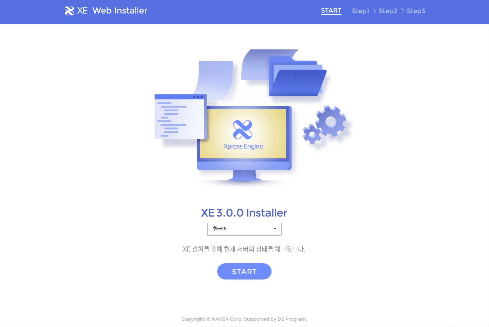
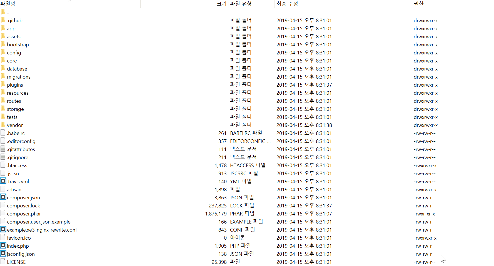

# 설치하기

## 서버 요구사항

XE를 설치하기 위해서는 아래의 요구사항이 만족되어야 합니다.
* 웹서버\(apache, nginx 등\)
* PHP 7 이상\(XE3.0.0-beta.24 부터\) 
  * PDO PHP Extension
  * cURL PHP Extension
  * FileInfo PHP Extension
  * GD PHP Extension
  * Mbstring PHP Extension
  * OpenSSL PHP Extension
  * Zip PHP Extension
* MariaDB or MySQL 5.1 이상
* 터미널 접속 환경
* 디스크 300M 이상의 여유 공간
  * 500M 이상 권장
  

## 권장 호스팅 환경
현재 일부 호스팅사에서 XE3를 정상적으로 사용할 수 있는 환경이 있으니 참고 부탁드립니다.
* <a href="https://www.cafe24.com/?controller=product_page&type=basic&page=autoban" target="_blank">CAFE24 - 10G 광아우토반</a>
 PHP 7.0 이상의 PHP버전을 권장하며, 가급적 php 7.1 이상의 버전을 선택하여 주시기 바랍니다.
* <a href="https://www.dothome.co.kr/web/premium/#section1" target="_blank">Dothome - 무제한 웹 호스팅 Basic 이상(Basic 포함)</a>
무제한 웹 호스팅의 FREE 플랜에서는 PHP 7.0 을 설치하더라도 ``allow_url_fopen`` 과 같은 옵션을 사용할 수 없기에, Basic 이상의 상품을 신청 후 기술지원 게시판을 통해 설정 변경 요청이 필요합니다.

  
## 다운로드
우선 XE 최신버전을 다운로드 받은 후, 압축을 풀어서 XE가 설치된 디렉토리에 덮어씌웁니다.

## 최신버전 다운로드 (터미널 환경)
### Linux

터미널에서 아래와 같이 명령어를 실행합니다.

```text
$ php -r "copy('http://start.xpressengine.io/download/installer', 'installer');" && php installer install
```
### Git

> Git을 사용하면 업데이트및 현재 개발중인 코드를 손쉽게 적용할 수 있습니다. 코어 버전 업데이트할 때 FTP 없이 Git 을 통해 업데이트 할 수 있습니다.

Github 저장소 파일을 이용해 설치합니다

```text
$ git clone https://github.com/xpressengine/xpressengine.git
$ cd xpressengine
$ composer install
...
$ php artisan xe:install
...
```
위 명령어 실행하면 인스톨이 시작되면 설치 정보를 입력합니다.

## 설치 정보 입력

#### 1. 데이터베이스, 사이트 정보 입력

_인스톨러 캡쳐 이미지_\(database, site 정보 입력 / 엔터\) 인스톨러가 Database 및 기본 설정 파일을 생성합니다. 이 작업은 시간이 오래 걸릴 수 있습니다.

* Host \[localhost\] : Database 주소. 기본 `localhost`
* Port \[3306\] : Database prot. 기본 `3306`
* Database name : Database name
* UserId \[root\] : Database user id. 기본 `root`
* Password \[\] : Database user password
* site url \[[http://mysite.com](http://mysite.com)\] : 홈페이지 주소 입력.

  > 하위 디렉토리에 설치 할 경우 하위 디렉토리 까지 입력해야합니다.

* Timezone \[Asia/Seoul\] : 타임존 정보를 입력합니다. 기본 `Asia/Seoul`

  > [타임존](http://php.net/manual/kr/timezones.php) 에서 원하는 지역의 시간대를 입력하세요.

* locale \[\] : 언어를 입력합니다. 영여, 한국어 두가지 언어를 지원합니다. 

  > 다른 언어의 설치는 인스톨 후에 언어팩을 업로드 해서 사용가능합니다. RC 버전에서 지원할 예정입니다.

인스톨은 영여, 한국어 두가지 언어 설치를 지원합니다. 다른 언어의 설치는 인스톨 후에 언어팩을 업로드 해서 사용가능합니다. RC 버전에서 지원할 예정입니다.

#### 2. 관리자 정보 입력

_인스톨러 캡쳐 이미지_\(관리자 정보 입력\)

* Email : 관리자 이메일
* Name \[admin\] : 관리자 이름. 기본 `admin`
* Password : 관리자 비밀번호
* Password again : 관리자 비밀번호 확인

#### 3. 디렉토리 권한 및 서버 정보 수집 동의

_인스톨러 캡쳐 이미지_\(설정\)

* ./storage directory permission \[0707\] : /storage 디렉토리 권한 설정. 기본 `0707`
* ./bootstrap/cache directory permission \[0707\] : /bootstrap/cache 디렉토리 권한 설정. 기본 `0707`
* Do you agree to collect your system environmental information? \[yes\] : 서버 환경 정보 수집 동의. 기본 `yes`

  > 더나은 서비스 제공을 위해 설치된 서버의 환경을 수집하고 있습니다. 서버, 웹서버, PHP, Database 등의 정보를 수집합니다.

## 설정 파일을 이용한 설치

설정파일을 사용하면 더욱 쉽게 설치할 수 있습니다. 설치하기 전에 아래와 같이 커맨드를 실행하여 설정파일을 생성합니다.

```text
$ copy('http://start.xpressengine.io/installer', 'installer');" && php installer make
```

xe\_install\_config.yaml 파일이 생성됩니다. 파일을 열고 설치 정보를 입력하세요. 설치 커맨드를 실행합니다. --config 및 --no-interact 옵션을 사용하십시오.

```text
$ php installer install --config=.xe_install_config.yaml --no-interact
```

#### 설치옵션

* --config=&lt; configfile&gt; 설정파일을 지정합니다.
* --no-interact 대화형입력을 사용하지 않고 설정파일의 정보를 사용하여 자동으로 설치합니다. 이 옵션을 --config옵션과 같이 사용해야 합니다.
* --install-dir 설치경로를 지정합니다. 지정하지 않을 경우 현재 디렉토리에 설치합니다.


## 최신버전 다운로드 (웹/FTP 환경)

> [http://start.xpressengine.io/download/latest.zip](http://start.xpressengine.io/download/latest.zip) 을 [다운로드](http://start.xpressengine.io/download/latest.zip) 합니다.
 다운로드 받은 zip 파일의 압축을 풀고 서버에 업로드 합니다. \(약 100MB\)

### 설치 동영상

이해를 위해 짧은 이미지를 준비했습니다

<center></center>

### FileZila

FTP는 FileZila 를 사용해서 설명합니다. FileZila 는 무료로 사용이 가능한 프로그램 입니다. [다운로드](https://filezilla-project.org/download.php?type=client)

### 디렉토리 권한 설정

**bootstrap/cache, config/production, storage, vendor, plugins 폴더 설정**

상단의 폴더들을 707 권한으로 변경해주세요.

> 권한 설정할 때 `하위 디렉터리로 이동`, `모든 파일과 디렉터리에 적용` 을 반드시 체크해 주세요  
또한, composer.lock에도 권한 설정을 부여해주세요 :)

<center></center>

### 웹 인스톨러 실행

설치할 사이트에 접속하면 인스톨 화면으로 이동됩니다.  
웹 서버가 파일을 쓸 수 있도록 권한을 설정합니다.

> 만약 하위 디렉토리에 설치할 경우는 해당 디렉토리로 접속해 주세요.

### 설치 진행하기

> DB 접속 정보를 모르거나, 정확히 입력해도 진행되지 않는다면, 사용하고 있는 호스팅 회사에 접속 방법을 문의하시기 바라며, 기본 포트와 호스트, DB 이름과 사용자 계정명이 다를 수 있습니다. 


## 알려진 문제점

### FTP의 파일 업로드 오류

파일 업로드 및 디렉토리 설정을 완료하고 웹 인스톨러 접근할 때 오류가 발생하는 경우가 있습니다. 이 문제는 FTP 파일 업로드 중 누락된 파일이 있어 발생할 수 있는 문제 입니다. 해결하기 위해서 FTP로 다시 업로드 해야합니다. 동일 조건을 업로드할 경우 비슷한 오류가 계속해서 발생할 수 있으므로 중복파일 `건너뛰기` 옵션으로 업로드 해보는걸 권장합니다.

### 웹 서버 타임아웃

서버 성능에 따라 웹 서버 타임아웃 설정에 의해 설치에 실패할 가능성이 있습니다. 이 문제는 사용하고 있는 호스팅 회사 또는 서버 관리자에게 문의하시기 바랍니다.

