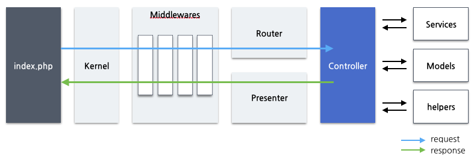

# 라이프 사이클

여러분이 XE를 사용하거나 XE의 플러그인을 개발하려는 개발자라면 XE의 사용법, 플러그인 제작법 그리고 XE에서 제공하는 여러가지 서비스들의 사용법만 숙지하는 것 만으로도 충분할 많은 것을 할 수 있습니다. 하지만 여러분이 좀더 고도의 기능을 필요로 하는 플러그인을 만들거나 XE를 제대로 사용하고 싶다면, XE가 어떤 방식과 어떤 구조로 요청을 처리하는지에 대한 전체적인 흐름을 알고 있어야 합니다. 전체적인 흐름을 알고 있지 않다면 결국 한계에 도달할 것이고, 전체적인 흐름을 알기 위해 노력하는 시점이 올 것입니다.

XE의 라이프 사이클은 크게 두 가지 경우로 나눌 수 있습니다. 사용자들이 웹브라우저를 통해 http 요청을 전송할 때 이를 처리하여 응답하는 일반적인 경우와, 사이트 관리자가 ssh와 같은 콘솔에 접근하여 php 명령을 실행시킬 경우가 있습니다. 이 문서에서는 더 일반적으로 생각할 수 있는 http 요청을 처리하는 경우에 대하여 살펴보겠습니다.

아래 다이어그램은 XE의 요청 처리 흐름을 개략적으로 보여줍니다.

## index.php

사용자의 웹브라우저로부터 http 전송 요청이 들어올 경우, XE는 항상 `index.php`파일을 실행시킵니다. `index.php` 파일이 그리 많은 코드를 가지고 있는 것은 아닙니다.

가장 먼저 `index.php`는 composer를 통해 생성된 autoload 파일을 로드합니다. autoload 파일을 로드함으로써 XE는 php 파일을 include하지 않고 자동으로 로드할 수 있게됩니다.

그 다음으로 서비스 컨테이너를 생성합니다. 서비스 컨테이너는 생성되자마자 주요 서비스인 라우팅(routing) 서비스와 이벤트(events) 서비스를 등록합니다.

세번째로는 http 요청을 처리하기 위한 Http 커널을 생성합니다. 그리고 현재 http 요청에 대한 정보를 가지는 `Request` 인스턴스를 생성합니다.

마지막으로 `Request` 인스턴스를 커널에게 전달하여 http 요청의 본격적인 처리를 시작합니다.

## Http 커널

Http 커널의 주목적은 단순하게 `Request`를 처리하고, 브라우저로 돌려줄 응답(Http Response)를 만드는 것입니다.

Http 커널은 `Illuminate\Foundation\Http\Kernel`를 상속받고 있으며, 생성된 다음에는 `Request`를 처리할 준비, 즉 부팅(bootstrapping)을 합니다.

Http 커널은 부팅 과정에서 에러 처리, 로그 설정, 어플리케이션의 실행 환경의 검사 등 실제로 요청이 처리되기 전에 수행해야 되는 작업들을 합니다.

또, Http 커널은 부팅 과정에서 데이터베이스, 문서, 회원과 같은 XE에서 제공하는 대부분의 [서비스](service.md)를 앞서 생성된 서비스 컨테이너에 등록합니다. 

## 미들웨어

Http 커널은 `Request` 처리할 준비가 완료되면, 커널에 등록된 미들웨어들에게 `Request`를 전달합니다. XE로 들어오는 모든 요청은 항상 이 미들웨어들을 한번씩 거치게 됩니다.

## Router
- find controller
- call controller

## Controller
- resolve request
- use many services

## Presenter
- make response
- apply skin, wrap theme
